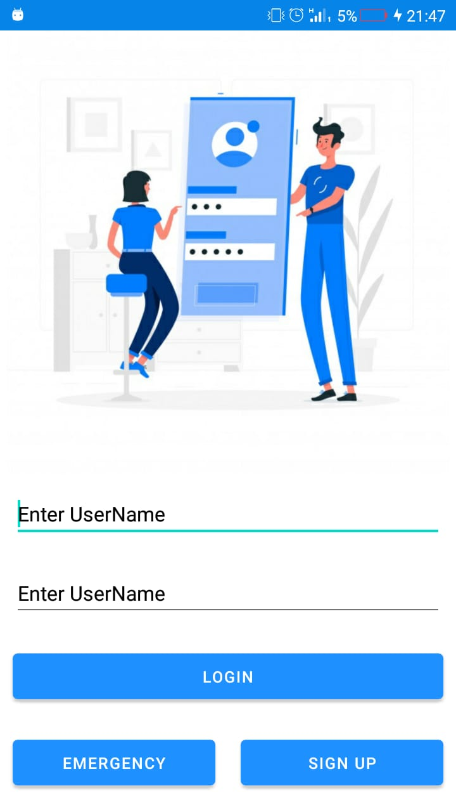
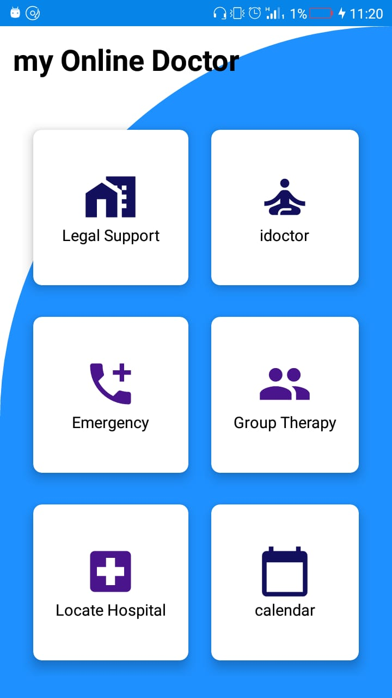

## iDoctor
Get your personal health care services in one app

### `About`
iDoctor is an application that helps patients locate nearby hospitals and access all the services including the emergency services in one touch. This application provides all the medical services ranging from booking treatments and checkups to scheduling counselling with the appropriate medical professional. 

iDoctor enables a patient to have easy and direct access conversation with a medical doctor. The patient can also receive and check the Doctor’s feedbacks and prescriptions through the prescriptions tab where all the prescription medicines and practices will be listed. 

iDoctor also has a reminder which will come in handy to remind the user of the coming or pending appointments that were booked and scheduled through the calendar module. For the case of sexual abuse and gender based violence, there is a tab for seeking legal support and emergency contacts.

### `APIs Used`
- Google Maps

---------------
### `Getting Started`

1. Clone the project iDoctor : git clone https://github.com/TimzOwen/iDoctor.git
2. Open with Android Studio
3. Run The Application

Screenshot of final app
--------------

---------------------------
Log in                                             |  Create Account
:----------------------------------------------------:|:-------------------------:
  |  
Main Page                                             |  Landing Page
:----------------------------------------------------:|:-------------------------:
  |  
Book Appointment                                        |  Chat Page
    |  
Reporting Incident                                        |  Meeting Scheduling
    |  
Find Hospital                                        |   Hospital Locations
    |  
Emergency Contacts                             | Database JSON Format           
     | 
Prescription
  |

<!-- Just a typo-->
